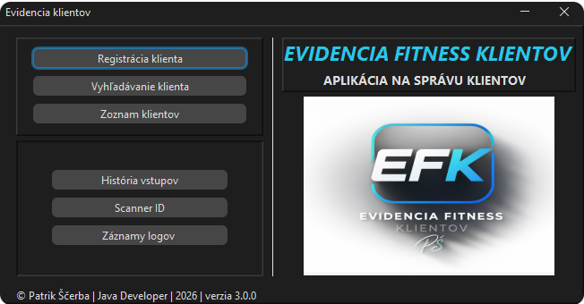

<a id="top"></a>
# Evidencia Fitnes Klientov – Hybridný systém správy klientov

**Hybridná desktopová aplikácia na správu klientov vo fitness centre.  
Projekt je navrhnutý ako evidenčný systém so zameraním na hybridný
offline/online režim, QR identifikáciu klientov a logovanie vstupov.**

Verzia: **3.0.0 (Hybrid DB + XML)**



**Prehľad používateľského rozhrania aplikácie.**

**Vizuálna dokumentácia aplikácie:**
[README_GALERIA.md](docs/README_GALERIA.md)
---

## Hlavné funkcionality
- Registrácia nových klientov
- Vyhľadávanie klientov
- Úprava údajov klienta
- Vymazanie klienta
- Detail klienta
- Predĺženie permanentky
- Generovanie QR kódu
- Zoznam klientov v tabuľke
- Skenovanie vstupu (simulácia)
- História vstupov
- Globálna história vstupov
- Logovanie systémových udalostí
---

## Hybridný režim (Databáza + XML)
### Aplikácia funguje v dvoch režimoch:

### ONLINE režim
- MySQL databáza ako primárny zdroj dát
- XML cache ako sekundárne úložisko

### OFFLINE režim
- Aktivuje sa pri nedostupnosti databázy
- Obmedzenie funkcií
- Vstupy sa ukladajú do XML
- Systém funguje bez prerušenia prevádzky
---

## QR identifikácia klienta

- Každý klient má unikátny QR token
- QR sa generuje pri registrácii
- QR sa zobrazuje v detaile klienta
- Opätovné generovanie QR kódu – nový token (pôvodný sa stáva neplatným)
- Používa sa pri vstupe do fitness centra
- Skenovanie simuluje turniket / recepciu
---

## História vstupov

### Globálna história
Zobrazuje všetky vstupy:

- Úspešné vstupy
- Zamietnuté vstupy
- Dôvod zamietnutia
- Režim (ONLINE / OFFLINE)

`Formát logu:
[Dátum/čas]| STATUS | klientId | meno=... | priezvisko=... | dôvod=... | režim=...`

### História klienta
Zobrazenie histórie vstupov konkrétneho klienta.

`Formát logu:
 [Dátum/čas]| STATUS | klientId | meno=... | priezvisko=... | dôvod=... | režim=...`

---

## Logovanie systému

### Systém zaznamenáva:

- Spustenie aplikácie
- Stav databázy
- Prepnutie režimu
- Chyby pripojenia
- Systémové výnimky

`Formát logu:
[Dátum/čas] [TYP]Aplikácia bola spustená.`
---

## Použité technológie
- Java 24+
- Swing (GUI)
- MySQL
- JDBC
- XML (DOM)
- ZXing (QR generovanie)
- FlatLaf (UI look & feel)
---

## UI & UX vylepšenia vo verzii 3.0.0
- Modernejší vzhľad aplikácie
- Zabezpečenie prostredia pre hybridný režim (DB + XML)
- Zabezpečenie tlačidiel v offline režime
- Zlepšenie vizuálnej konzistencie a použiteľnosti
- Nové rozloženie prvkov vo všetkých oknách
- Prehľadná centrálna karta detailu klienta s dvoma režimami
---

## Architektúra projektu
### Projekt je rozdelený do vrstiev:
```
 📂 Štruktúra projektu

EvidenciaFitnesKlientov_Hybrid
│
│── screenshots/   → obrázky z aplikácie
├── data/          → XML dáta + logy
├── db/            → SQL schéma
├── docs/          → implementačný plán, vizuálna dokumentácia
├── qr_kody/       → uložené QR kódy klientov
├── vystup/        → exportovaný QR výstup
│
├── src/main/java/sk.patrikscerba
│   ├── app        → štart aplikácie
│   ├── dao        → databázová vrstva
│   ├── io         → logovanie, XML, DB
│   ├── model      → dátové modely
│   ├── qr         → QR servis
│   ├── servis     → business logika
│   ├── system     → režimy aplikácie
│   ├── ui         → Swing rozhranie
│   └── vstup      → evidencia vstupov
│
└── resources/    → logo, konfigurácia
```
---

## Testovanie

### ***Aplikácia bola testovaná ako desktopová aplikácia.***

### ***Testované scenáre:***

- Registrácia, úprava a vymazanie klienta
- Paralelná registrácia, úprava a vymazanie klienta pri dostupností databázy
- Paralelný zápis/čítanie predĺženia permanentky/kontrola
- vyhľadávanie podľa mena/priezviska
- paralelný zápis/čítanie vstupu klienta (OFFLINE/ONLINE)
- Zobrazenie detailu klienta a jeho histórie vstupov
- Validácie pre všetky polia
- Generovanie QR kódu
- Znovu generovanie QR kódu s novým tokenom
- Príprava QR kódu pre tlač.
- Skenovanie vstupu (simulácia)
- Prepnutie do offline režimu (DB nedostupná)
- Obmedzenie funkcií v offline režime
- Obmedzenie vstupov v offline režime
- Zobrazenie zoznamu klientov v offline/online režime
- Zobrazenie globálnej histórie vstupov v online a offline režime
- Zobrazenie detailu klienta a jeho histórie vstupov v online/offline režime
- Ukladanie vstupov do XML v offline režime
- Logovanie systémových udalostí
- Logovanie vstupov klientov (čas, id,meno,  dôvod zamietnutia, režim)
---

## Spustenie projektu

1. Naklonuj repository
2. Spusti MySQL server
3. Importuj SQL schému z `db/fk_evidencia_hybrid_schema.sql`
4. Vytvor súbor `db.properties` v root adresári:
```
Java
- db.url=jdbc:mysql://localhost:3306/fk_evidencia_hybrid
- db.user=your_username
- db.password=your_password
- db.driver=com.mysql.cj.jdbc.Driver
```
5. Spusti aplikáciu pomocou Maven alebo z IDE.
6. Spusť aplikáciu cez `EvidenciaFitnesKlientovApp`
---

## Cieľ projektu

- Osobné portfólio
- Pochopenie architektúry desktopovej aplikácie
- Ukážka hybridnej architektúry
- Implementácia hybridnej perzistencie (DB + XML fallback)
- Komplexnejšia správa evidencie vstupov vo fitness centre
- Simulácia reálneho systému kontroly vstupov
- Návrh reálnej evidencie klientov vo fitness centre
---

## Vývoj projektu
- v1 → XML
- v2 → JDBC + MySQL
- ***v3 → Hybrid DB + XML (aktuálna verzia projektu)***
- v4 → Spring Boot + react (v vývoji)
---

## Autor
**Patrik Ščerba**  
Java Developer

- GitHub: https://github.com/PatrikScerba
- LinkedIn: https://www.linkedin.com/in/patrikscerba/
---

### Prejsť na vizuálnu dokumentáciu:
  - [README_GALERIA.md](docs/README_GALERIA.md)
### Implementačný plán systému:
- [ImplementacnyPlan_V3.md](docs/ImplementacnyPlan_V3.md)
### [Späť na začiatok ](#top)


