# Galéria rozhrania aplikácie

 Táto stránka obsahuje vizuálnu dokumentáciu používateľského rozhrania aplikácie – jednotlivé obrazovky systému, formuláre a funkcie.

---
## Obsah
- [Hlavné menu](#hlavné-menu)
- [Správa klientov](#správa-klientov)
- [QR systém](#qr-systém)
- [Hybridný režim](#hybridný-režim)
- [História vstupov](#história-vstupov)
- [Systémové logy](#systémové-logy)
- [Späť na hlavné README.md](../README.md)
---

## Hlavné menu
Hlavné menu poskytuje prístup k hlavným funkciám aplikácie na správu klientov.
Umožňuje prechod do sekcií registrácie klienta, vyhľadávania, zoznamu klientov, histórie vstupov, skenera ID a záznamov logov.

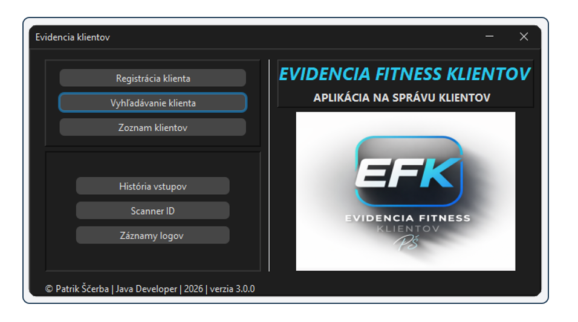

---
## Správa klientov

### Registrácia klienta

Formulár na vytvorenie nového klienta v systéme.

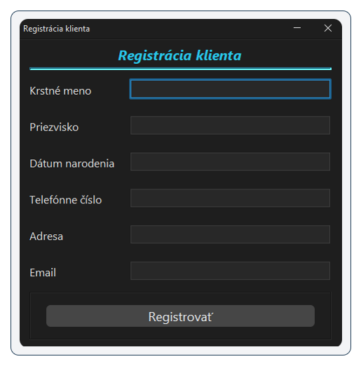

### Validácia formulára

Systém kontroluje správnosť zadaných údajov a upozorní na chybný vstup.

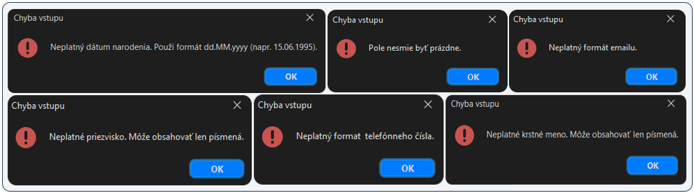

### Vyhľadávanie klienta

Vyhľadávanie klientov podľa mena alebo priezviska s podporou výberu pri viacerých výsledkoch.

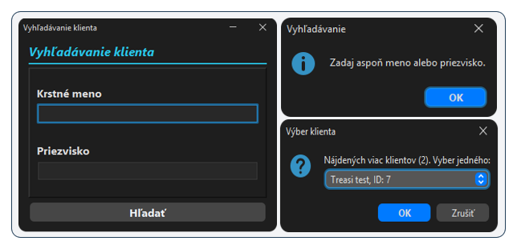

### Detail klienta

Zobrazuje kompletné informácie o klientovi vrátane QR identifikátora,
ktorý sa automaticky generuje pri registrácii klienta.

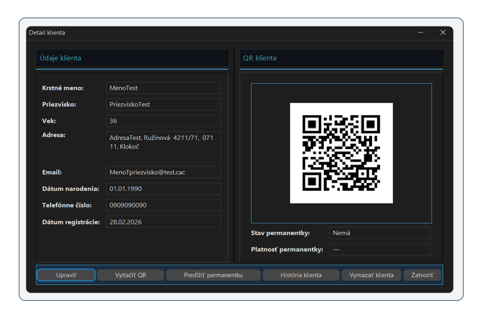

### Úprava klienta

Formulár umožňuje zobraziť a upraviť údaje existujúceho klienta v systéme.
Používateľ môže aktualizovať osobné údaje klienta a uložiť vykonané zmeny.

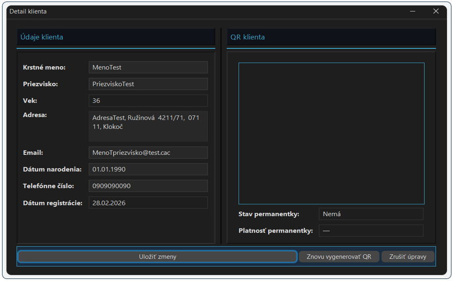

### Oznámenia

Systém zobrazuje informačné a potvrdzovacie okná pri vykonávaní dôležitých operácií, ako je napríklad predĺženie permanentky alebo vymazanie klienta.

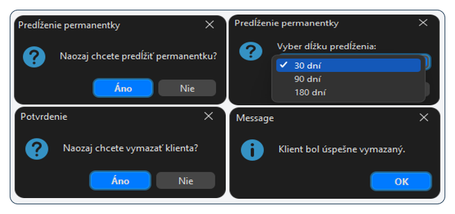

- [Späť na obsah](#obsah)
---

## Zoznam klientov

Tabuľkový prehľad všetkých klientov uložených v systéme vrátane údajov
o permanentke a dátume registrácie.

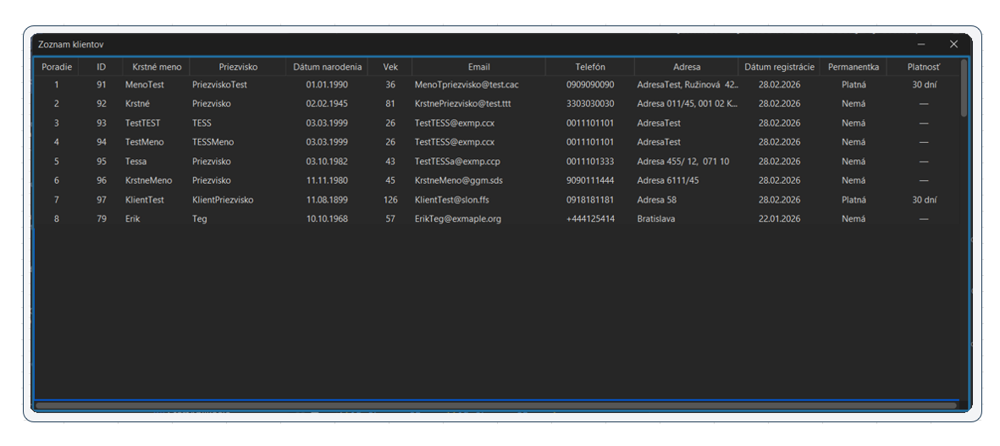
- [Späť na obsah](#obsah)
---

## QR systém

### Obnovenie QR kódu

QR kód klienta je možné znovu vygenerovať v režime úpravy klienta.
Používa sa napríklad pri strate alebo kompromitovaní pôvodného identifikátora.

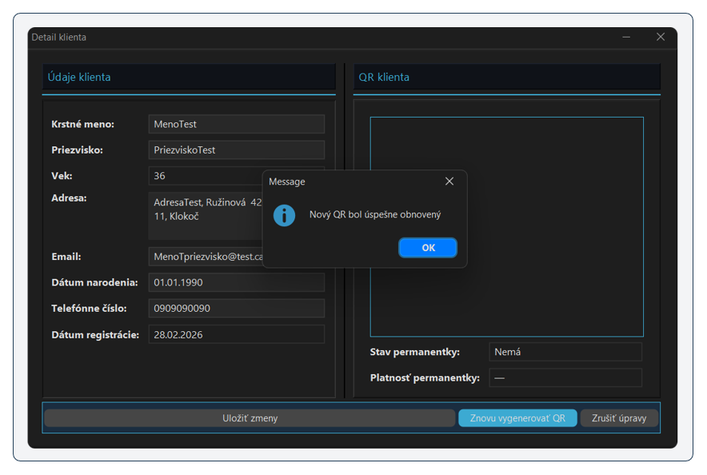

### Tlač QR kódu

Pri použití funkcie vytlačiť QR aplikácia uloží QR kód klienta ako obrázok do výstupného priečinka aplikácie, odkiaľ je možné ho následne vytlačiť.

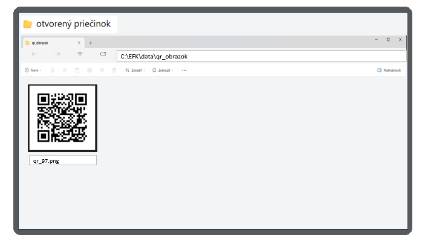

Ilustračný príklad uloženého QR kódu vo výstupnom priečinku aplikácie.

### Skenovanie vstupu

Simulácia vstupu klienta pomocou QR identifikátora.

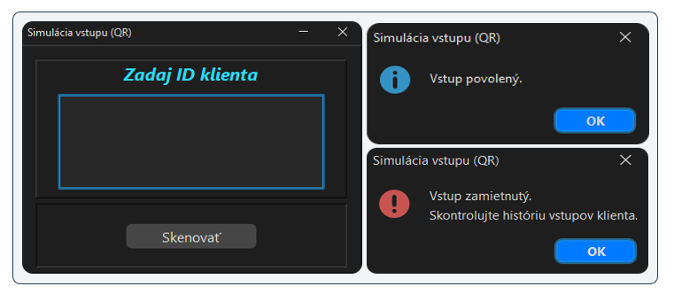
- [Späť na obsah](#obsah)
---

## Hybridný režim

Aplikácia automaticky prejde do offline režimu pri nedostupnej databáze.

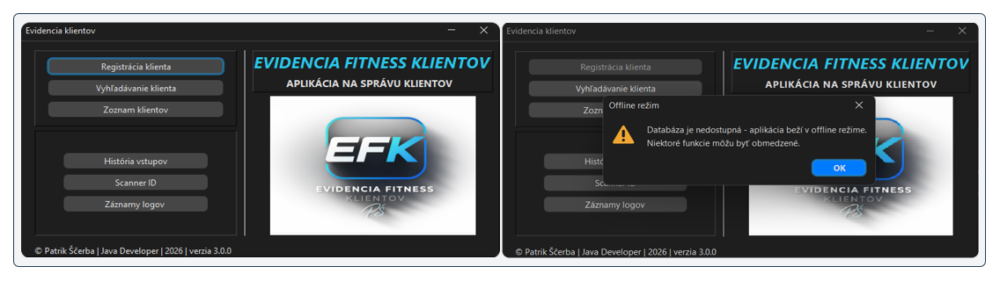

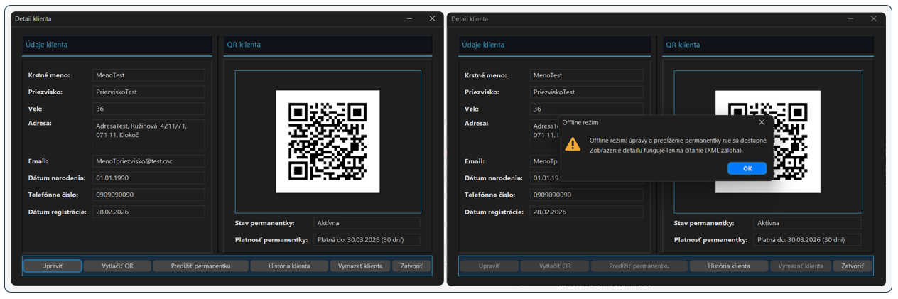

### Offline režim

- zobrazenie upozornenia pre zamestnanca
- obmedzenie niektorých funkcií
- čítanie dát z XML zálohy

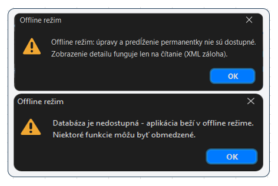
- [Späť na obsah](#obsah)
---

## História vstupov

### Globálna história vstupov

Prehľad všetkých zaznamenaných vstupov klientov do systému.

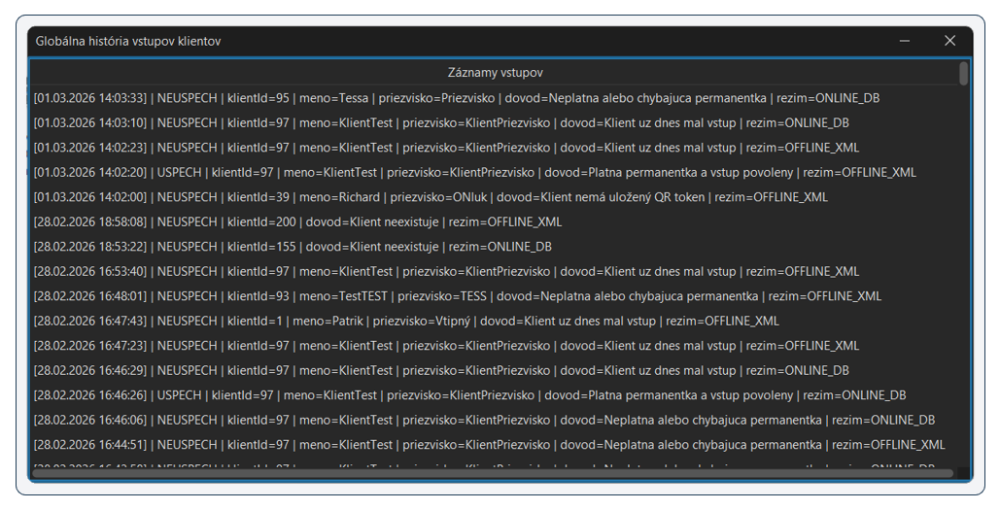

### História vstupov klienta

Zobrazuje chronologický prehľad všetkých vstupov konkrétneho klienta do systému.
Obsahuje informácie o čase vstupu, výsledku kontroly a použitom režime systému
(online databáza alebo offline XML záloha).

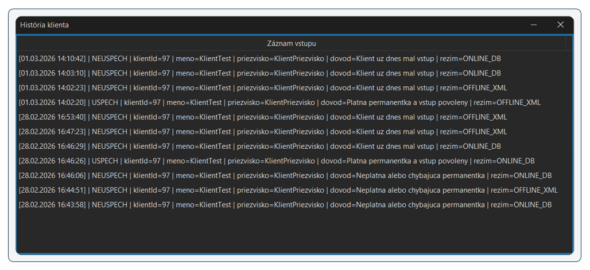

---

## Systémové logy

Prehľad interných systémových udalostí aplikácie.
Logy obsahujú informácie o stave aplikácie, pripojení k databáze,
chybových hláseniach a diagnostických správach pre monitoring systému.

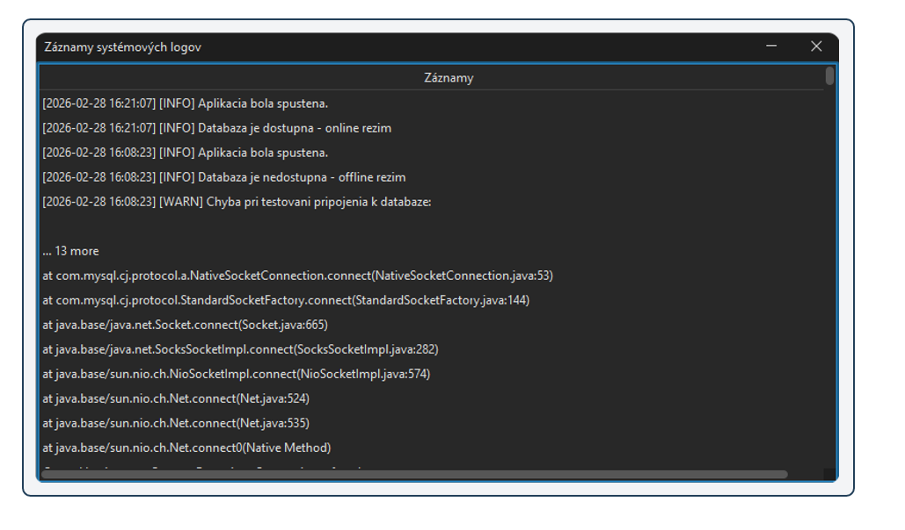

---

### [Späť na obsah](#obsah)

Odkaz: [Späť na hlavné README.md](../README.md)

